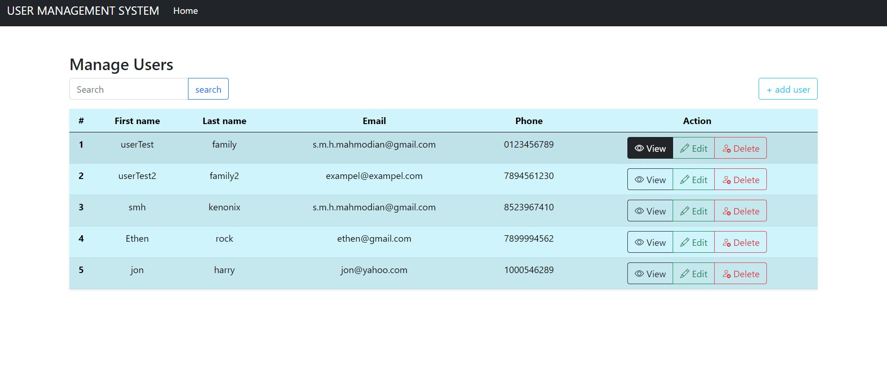

# User Management System

The User Management System is a web application built with Node.js, Express, Bootstrap, HBS, and MySQL. It provides functionality to view user information, edit existing users, delete users, and add new users.



## Technologies Used

- **Backend**: [Node.js](https://nodejs.org/en) with [Express.js](https://www.npmjs.com/package/express) (Web application framework)
- **Frontend**: [Bootstrap](https://getbootstrap.com/) (CSS framework) with [HBS](https://www.npmjs.com/package/has) (Templating engine)
- **Database**: [MySQL](https://www.npmjs.com/package/mysql) (Relational database management system)

## Installation

1. Clone the repository:

    ```bash
    git clone https://github.com/smh-kneonix/user-managment-system.git
    ```
2. Run MySQL database:

    ```bash
    docker-compose up
    ```

    > HINT: if you want to use your own server make sure config the .env file

3. Install packages:

    ```bash
    npm install
    ```

4. Run the project:


    ```bash
    npm start
    ```
    now you can access the application on http://localhost:5000/ and enjoy

## usage

- Browse the list of existing users and their details.
- Edit user details by clicking the "Edit" button.
- Delete a user by clicking the "Delete" button.
- To add a new user, click the "Add User" button and fill in the required fields.
- Also you can search for the user you looking for

## feature 

- The system will validate all the inputs like phone number and email address to ensure they are valid.

- The system utilizes the "morgan" package to log every request made to the server. The logs provide helpful information such as the HTTP method, URL, response status, and response time. These logs can help debug and monitor purposes.
